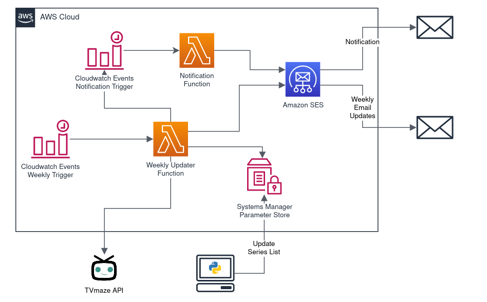

# Series Airdate Updater

This Solution utilizes the open TVmaze API to provide weekly email updates on the air-dates of your ongoing TV series. 

# Architecture
The Solution is based around the AWS Lambda functions that invokes the API and retrieves the latest information about the series air-dates. The function then uses the Amazon SES service to send an update email. CloudWatch Events is used to schedule the triggering of the Lambda function. Lastly the update of the list of series is handled by a python script located in `update-series-list/`.



The Solution sends you an email with information similar to the following table:

| Name           | Previous Ep. | Airtime    | Next Ep. | Airtime    |
| -------------- | ------------ | ---------- | -------- | ---------- |
| 13 Reasons Why | s3e13        | 2019-08-23 | s4e1     | 2020-06-05 |
| Hanna          | s2e3         | 2020-07-03 | s2e4     | 2020-07-03 |
| Yellowstone    | s3e2         | 2020-06-28 | s3e3     | 2020-07-05 |
| Atlanta        | s2e11        | 2018-05-10 | No Data  | No Data    |
| Westworld      | s3e8         | 2020-05-03 | No Data  | No Data    |

# Todo

* Add logging on Lambda
* Verify CloudWatch events
* Verify free-tier
* Resolve "The-Boys" issue
* Improve README
* Investigate Integration with Calendar

# Prerequisites
* AWS Account
* Install and configure `aws-cli` and `sam-cli`
* Working `python3.7` environment
* Create S3 bucket name to store the build artifacts
* Set up email on Amazon SES (Cannot be done via CloudFormation)
  * [Amazon SES Quick Start](https://docs.aws.amazon.com/ses/latest/DeveloperGuide/quick-start.html)
  * [Setting up Email with Amazon SES](https://docs.aws.amazon.com/ses/latest/DeveloperGuide/send-email-set-up.html)

# How to deploy (SAM)
### Install Dependencies
``` bash
sam build
```

### Deploy the Infrastructure & Code
``` bash
sam deploy --stack-name series-airdate-updater --s3-bucket <s3-bucket-name> --region <aws-region> --parameter-overrides Email=<email@example.com> --capabilities CAPABILITY_NAMED_IAM
```
where: `<s3-bucket-name>` is the bucket you have previously created, `<aws-region>` is the region of AWS that you are deployin to (eg. eu-west-1) and `<email@example.com>` is the email that you have set up on SES


### Update Series List
First install the necessary requirements for the `update-series-list.py` script by doing:
``` bash
pip3 install -r update-series-list/requirements.txt
```

Then, you can update the Lambda Environment variables by providing the appropriate input parameters.
``` bash
python3 update-series-list/update-series-list.py --lambdaname <function-name> --filename <txt-file-name>
```
where `<function-name>` is the name of the Lambda function you have previously created and `<txt-file-name>` is a text file that has your series titles (one per line). This script will read the list of TV series from `<txt-file-name>`  retrieve their ids and then update the Lambda Environment variables with the appropriate values. You can run again this script if you want to add/remove more series.

You can also retrieve the current Lambda series list and save it on a file by doing:
``` bash
python3 update-series-list/update-series-list.py --getserieslist --filename <txt-file-name>
```

**Note:** When redeploying, depending on the changes of the Lambda function in AWS, you might need to run again `update-series-list/update-series-list.py` to set the series list in the Lambda Environment Variables.

# License
Licensed under the Apache License, Version 2.0 ([LICENSE](LICENSE)
or http://www.apache.org/licenses/LICENSE-2.0).

## Contribution

Unless you explicitly state otherwise, any contribution intentionally submitted
for inclusion in the work by you, as defined in the Apache-2.0 license, shall be
licensed as above, without any additional terms or conditions.